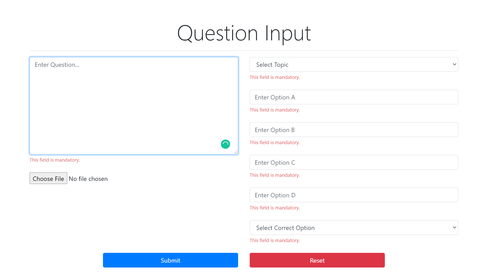
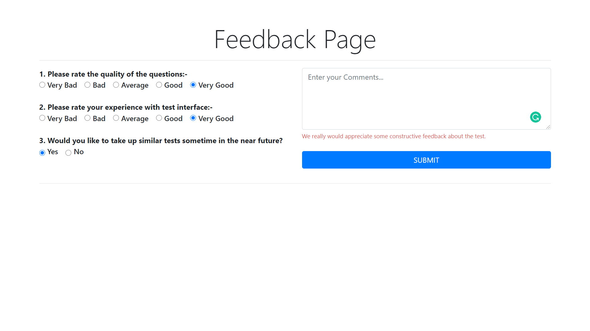

# AptitudeTestSoftware

LAMP Application to conduct mock aptitude tests at SVCE.

Complete with user authentication, automatic result evaluation, mailing module, attendance generation and much more...

## Contents
- [Why did we build this?](#why-did-we-build-this)
- [Getting Started](#getting-started)
  - [Prerequisites](#prerequisites)
- [Technologies](#technologies)
- [Project Structure](#project-structure)
- [Usage](#usage)
- [Features and Screenshots](#features-and-screenshots-click-to-enlarge)
- [Tools](#tools)
- [Acknowledgements](#acknowledgements)
- [Contributors](#contributors)
- [Contributing](#contributing)
- [LICENSE](#license)

## Why did we build this?
We run a chapter (club) at our college where we assist 500+ pre-final year students to prepare for their upcoming placements through a plethora of events such as mock interviews, aptitude tests and group discussions. It was a tedious process to format questions, distribute them to students, evaluate their answers and give them constructive feedback and so we decided to automate this process.

## Getting Started
 
### Prerequisites
What you need to run the application:-
* A web server with PHP preferably Apache2.
* A MySQL Database Server.
* [Composer](https://getcomposer.org/download/)

## Technologies
* **Front-End** - HTML, CSS, JS (ES6), Bootstrap 4
* **Back-End**  - PHP, MySQL

## Project Structure

```
AptitudeTestSoftware/
  .git                # Git Source Directory
  app/                # HTML, CSS, JS, PHP source code
  database/           # SQL Schema
  includes/           # Database credentials and utility helpers
  mail/               # Mailing Module
  screenshots/        # Applications screenshots for documentation
  vendor/             # Composer files and 3rd party packages
  .gitignore          # Files and folders to be ignored by version control
  .htaccess           # Site Configuration File
  .prettierignore     # Files to be ignored by Prettier
  composer.lock       # Composer lockfile
  composer.json       # Composer dependency file
  favicon.ico         # Favicon for the application
  index.php           # Application entry point
  LICENSE             # MIT License file
  README.MD           # Brief documentation
```

## Usage
This is a simple test software. Every question has 4 options, out of which only one is correct.

* `/input` - Create questions for the test.
* `/login` - Log in to start test.
* `/rules` - View rules page.
* `/questions` - View and attempt test questions.
* `/feedback` - Submit test feedback.
* `/finish` - View your marks.
* `/answers` - View the correct answers of the test.
* `/attendance` - Generate CSV files for department-wise attendance.

## Features and Screenshots (Click to enlarge)
| Login Page                        | Rules Page                        | Test Page                        | 
| --------------------------------- | --------------------------------- | -------------------------------- | 
|  |  |  | 

| Question Input Page               | Feedback Page                        | Result Page                        |
| --------------------------------- | ---------------------------------    | ---------------------------------- |
|  |  |  |

## Tools
* [Visual Studio Code](https://code.visualstudio.com/)
* [XAMPP](https://www.apachefriends.org/download.html)

## Acknowledgements
We used a combination of many tutorials and StackOverflow posts to create this project. The following have been the most important.
* [Connect PHP and MySQL using PDO](https://phpdelusions.net/pdo)
* [Prevent Timer Reset on Page Reload](https://stackoverflow.com/questions/49497658/prevent-timer-reset-on-page-refresh)
* [CSS Grid](https://css-tricks.com/snippets/css/complete-guide-grid/)
* [Storing Images Using PHP/MySQL](https://stackoverflow.com/questions/26757659/how-to-store-images-in-mysql-database-using-php)

## Contributors
* Design and Development - [Nilesh D](https://github.com/Nilesh2000)
* Design and Development - [Arjun Aravind](https://github.com/ArjArv98)

## Contributing
Please feel free to fork, comment, critique, or submit a pull request.

## License
This project is open source and available under the [MIT License](https://github.com/ForeseTech/AptitudeTestSoftware/blob/main/LICENSE).
