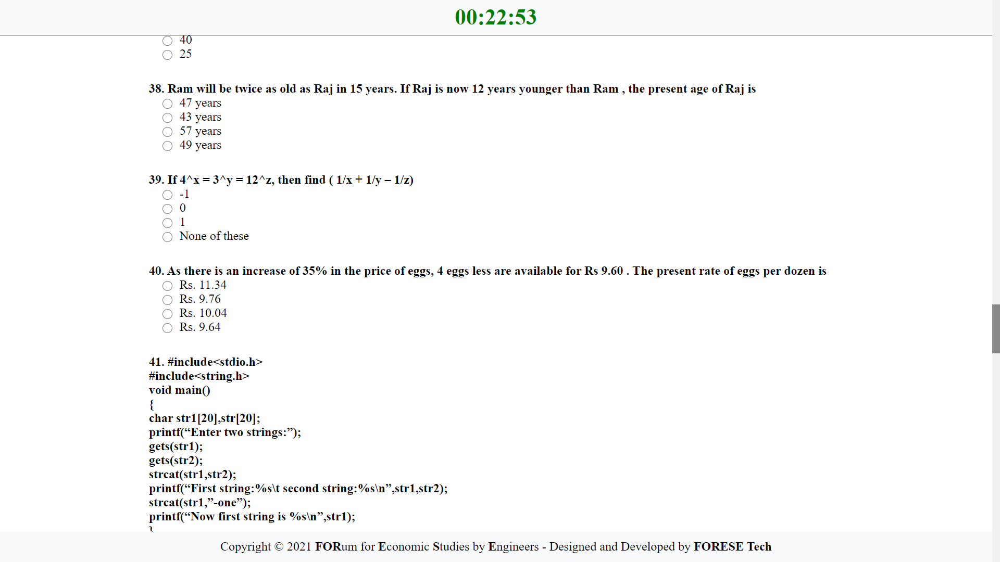

**LAMP Application to conduct mock aptitude tests at SVCE. Hosted and deployed to Heroku.**

Complete with user authentication, automatic result evaluation, mailing module and much more...

## Contents
- [Why did we build this?](#why-did-we-build-this)
- [Getting Started](#getting-started)
  - [Prerequisites](#prerequisites)
- [Technologies](#technologies)
- [Features and Screenshots](#features-and-screenshots-click-to-enlarge)
- [Tools](#tools)
- [Contributors](#contributors)

## Why did we build this?
We run a chapter (club) at our college where we assist 500+ pre-final year students to prepare for their upcoming placements through a plethora of events such as mock interviews, aptitude tests and group discussions. It was a tedious process to format questions, distribute them to students, evaluate their answers and give them constructive feedback and so we decided to automate this process.

## Getting Started
 

### Prerequisites
What you need to run the application:-
* A web server with PHP preferably Apache2.
* A MySQL Database Server.

## Technologies
* **Front-End** - HTML, CSS, JS (ES6), Bootstrap 4
* **Back-End**  - PHP, MySQL

## Features and Screenshots (Click to enlarge)
| Login Page                        | Rules Page                        | Test Page                        | Result Page                        |
| --------------------------------- | --------------------------------- | -------------------------------- | ---------------------------------- |
|  |  |  |  |

## Tools
* [Visual Studio Code](https://code.visualstudio.com/)
* [XAMPP](https://www.apachefriends.org/download.html)

## Contributors
* Design and Development - [Nilesh D](https://github.com/Nilesh2000)
* Design and Development - [Arjun Aravind](https://github.com/ArjArv98)
* Hat tip to anyone whose code was used :).
