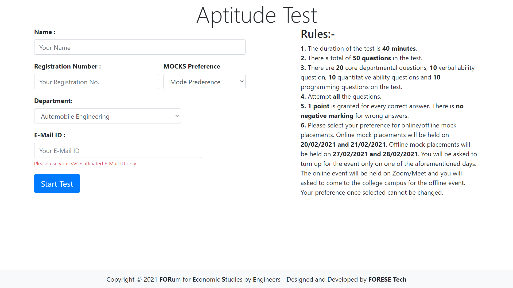

# AptitudeTestSoftware

LAMP Application to conduct mock aptitude tests at SVCE.

Complete with user authentication, automatic result evaluation, mailing module, attendance generation and much more...

## Contents
- [Motivation](#motivation)
- [Installation](#installation)
- [Project Structure](#project-structure)
- [Usage](#usage)
- [Features and Screenshots](#features-and-screenshots-click-to-enlarge)
- [Tools](#tools)
- [Acknowledgements](#acknowledgements)
- [Contributors](#contributors)
- [Contributing](#contributing)
- [LICENSE](#license)

## Motivation
We run a chapter (club) at our college where we assist 500+ pre-final year students to prepare for their upcoming placements through a plethora of events such as mock interviews, aptitude tests and group discussions. It was a tedious process to prepare questions, invigilate tests, evaluate answer sheets, and give constructive feedback to students and so we decided to automate the process.

The software runs on PHP 7.2 and MySQL. The CSS framework [Bootstrap 4](https://getbootstrap.com/) was used for the design.

 
## Installation

### Install Apache, MySQL, and PHP
It is assumed you already know how to install LAMP stack. For macOS and Windows local development, I would recommend downloading [XAMPP](https://www.apachefriends.org/download.html) for a sandboxed environment. 

## Project Structure

```
AptitudeTestSoftware/
  .git                # Git Source Directory
  app/                # HTML, CSS, JS, PHP source code
  database/           # SQL Schema
  includes/           # Database credentials and utility helpers
  mail/               # Mailing Module
  screenshots/        # Applications screenshots for documentation
  vendor/             # Composer files and 3rd party packages
  .gitignore          # Files and folders to be ignored by version control
  .htaccess           # Site Configuration File
  .prettierignore     # Files to be ignored by Prettier
  composer.lock       # Composer lockfile
  composer.json       # Composer dependency file
  favicon.ico         # Favicon for the application
  index.php           # Application entry point
  LICENSE             # MIT License file
  README.MD           # Brief documentation
```

## Usage
This is a simple test software. Every question has 4 options, out of which only one is correct.

* `/input` - Create questions for the test.
* `/login` - Log in to start test.
* `/rules` - View rules page.
* `/questions` - View and attempt test questions.
* `/feedback` - Submit test feedback.
* `/finish` - View your marks.
* `/answers` - View the correct answers of the test.
* `/attendance` - Generate CSV files for department-wise attendance.

## Features and Screenshots (Click to enlarge)
| Login Page                        | Rules Page                           | Test Page                          | 
| --------------------------------- | ------------------------------------ | ---------------------------------- | 
|  |     |    | 

| Question Input Page               | Feedback Page                        | Result Page                        |
| --------------------------------- | ------------------------------------ | ---------------------------------- |
|  |  |  |

## Tools
* [Visual Studio Code](https://code.visualstudio.com/)
* [XAMPP](https://www.apachefriends.org/download.html)

## Acknowledgements
We used a combination of many tutorials and StackOverflow posts to create this project. The following have been the most important.
* [Connect PHP and MySQL using PDO](https://phpdelusions.net/pdo)
* [Prevent Timer Reset on Page Reload](https://stackoverflow.com/questions/49497658/prevent-timer-reset-on-page-refresh)
* [CSS Grid](https://css-tricks.com/snippets/css/complete-guide-grid/)
* [Storing Images Using PHP/MySQL](https://stackoverflow.com/questions/26757659/how-to-store-images-in-mysql-database-using-php)
* [Execute JavaScript in AJAX Response](https://subinsb.com/how-to-execute-javascript-in-ajax-response/)

## Contributors
* Design and Development - [Nilesh D](https://github.com/Nilesh2000)
* Design and Development - [Arjun Aravind](https://github.com/ArjArv98)

## Contributing
Please feel free to fork, comment, critique, or submit a pull request.

## License
This project is open source and available under the [MIT License](https://github.com/ForeseTech/AptitudeTestSoftware/blob/main/LICENSE).
